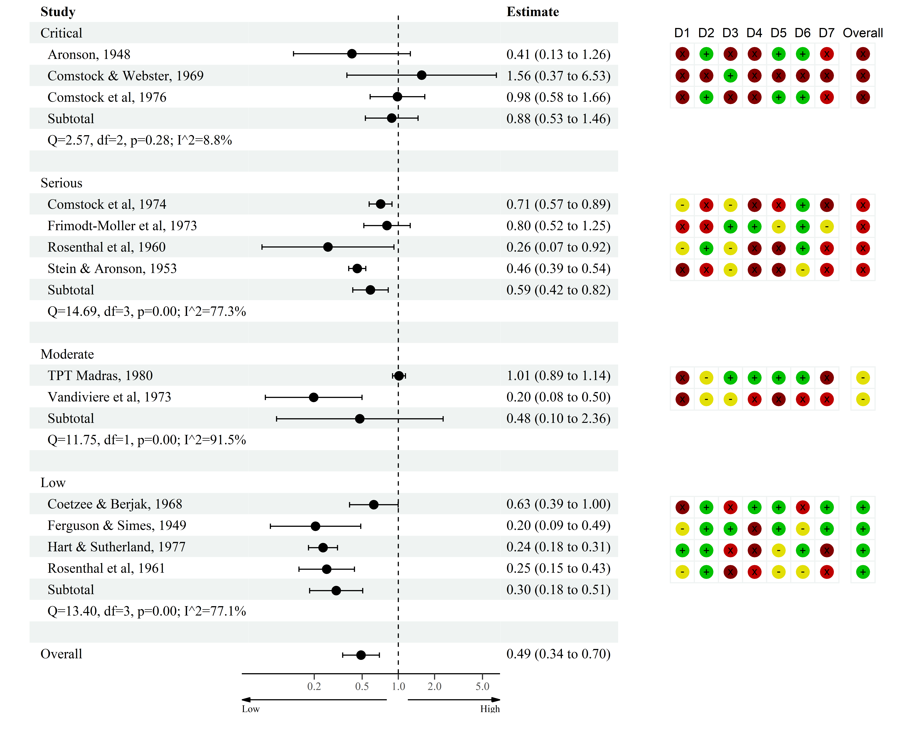
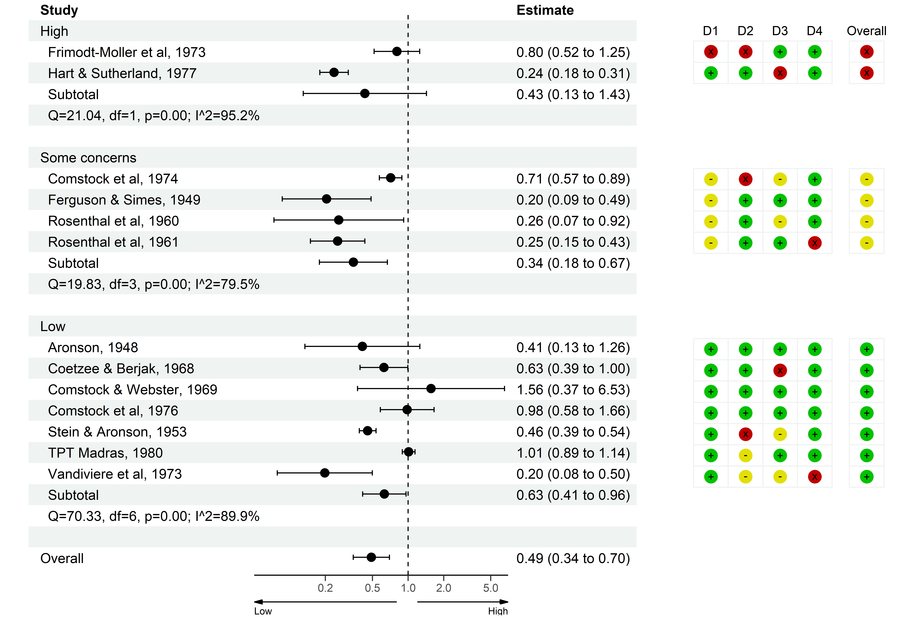

```{r, include = FALSE}
knitr::opts_chunk$set(
  collapse = TRUE,
  comment = "#>"
)
```

```{r setup}
library(forester)
library(metafor)
library(robvis)
library(ggplot2)
library(dplyr)
```

```{r}
select_rob_columns <- function(dataframe, tool){
  if(tool == "QUADAS-2"){
    return_data <- select(dataframe, D1, D2, D3, D4, Overall)
  }else if(tool == "ROB1"){
    return_data <- select(dataframe,
           RS = Random.sequence.generation.,
           A = Allocation.concealment.,
           BP = Blinding.of.participants.and.personnel.,
           BO = Blinding.of.outcome.assessment,
           I = Incomplete.outcome.data, 
           SR = Selective.reporting.,
           Oth = Other.sources.of.bias., 
           Overall = Overall)
  }else if(tool == "ROB2"){
    return_data <- select(dataframe, D1, D2, D3, D4, D5, Overall)
  }else if(tool == "ROB2-Cluster"){
    return_data <- select(dataframe, D1, D1b, D2, D3, D4, D5, Overall)
  }else if(tool == "Robins"){
    return_data <- select(dataframe, D1, D2, D3, D4, D5, D6, D7, Overall)
  }else{
    stop("Tool is not supported.")
  }
  return(return_data)
}
```


```{r}
get_colour <- function(tool, colour) {
  rob_colours <- c()

  rob_colours$na_colour <- "#cccccc"

  if (tool == "ROB2" || tool == "ROB2-Cluster" || tool == "QUADAS-2") {
    if (length(colour) > 1) {
      rob_colours$low_colour <- colour[c(1)]
      rob_colours$concerns_colour <- colour[c(2)]
      rob_colours$high_colour <- colour[c(3)]
      rob_colours$ni_colour <- colour[c(4)]
    } else {
      if (colour == "colourblind") {
        rob_colours$low_colour <- "#fed98e"
        rob_colours$concerns_colour <- "#fe9929"
        rob_colours$high_colour <- "#d95f0e"
        rob_colours$ni_colour <- "#ffffff"
      }
      if (colour == "cochrane") {
        rob_colours$low_colour <- "#02C100"
        rob_colours$concerns_colour <- "#E2DF07"
        rob_colours$high_colour <- "#BF0000"
        rob_colours$ni_colour <- "#4EA1F7"
      }
    }
  } else {
    if (length(colour) > 1) {
      rob_colours$low_colour <- colour[c(1)]
      rob_colours$concerns_colour <- colour[c(2)]
      rob_colours$high_colour <- colour[c(3)]
      rob_colours$critical_colour <- colour[c(4)]
      rob_colours$ni_colour <- colour[c(5)]
    } else {
      if (colour == "colourblind") {
        rob_colours$low_colour <- "#fed98e"
        rob_colours$concerns_colour <- "#fe9929"
        rob_colours$high_colour <- "#d95f0e"
        rob_colours$critical_colour <- "#993404"
        rob_colours$ni_colour <- "#ffffff"
      }
      if (colour == "cochrane") {
        rob_colours$low_colour <- "#02C100"
        rob_colours$concerns_colour <- "#E2DF07"
        rob_colours$high_colour <- "#BF0000"
        rob_colours$critical_colour <- "#820000"
        rob_colours$ni_colour <- "#4EA1F7"
      }
    }
  }

  return(rob_colours)
}
```

```{r}
metafor_function <- function(res, data = dat){
  eval(rlang::call_modify(res$call, data = quote(data)))
}
```

```{r}
create_subtotal_row <- function(rma,
                                 name = "Subtotal",
                                 single_group = FALSE,
                                 add_tests = FALSE,
                                 add_blank = TRUE){

   if (single_group == FALSE) {
     row <- data.frame(Study = name,
                       est = exp(rma$b),
                       ci_low = exp(rma$ci.lb),
                       ci_high = exp(rma$ci.ub))


     if (add_tests) {

       tests <- data.frame(
         Study = paste0(
           "Q=",
           formatC(rma$QE, digits = 2, format =
                     "f"),
           ", df=",
           rma$k - rma$p,
           ", p=",
           formatC(rma$QEp, digits = 2, format = "f"),
           "; ",
           "I^2",
           "=",
           formatC(rma$I2, digits = 1, format =
                     "f"),
           "%"
         ),

         est = c(NA),
         ci_low = c(NA),
         ci_high = c(NA))


       row <- rbind(row,
                    tests)
     }


     if(add_blank){row <- dplyr::add_row(row)}


     return(row)
   }
}
```


```{r}
create_title_row <- function(title){
  return(data.frame(Study = title, est = NA, ci_low = NA, ci_high = NA))
}
```


```{r}
metafor_object_to_table <- function(rma, 
                                    rob, 
                                    add_tests = TRUE, 
                                    overall_estimate = TRUE, 
                                    subset_col = "Overall", 
                                    rob_colour = "cochrane", 
                                    rob_tool = "ROB2",
                                    subset_col_order = NULL){
  
  table <- merge(data.frame(Study = rma$slab,
                             yi = rma$yi,
                             vi = rma$vi,
                             est = exp(rma$yi),
                             ci_low = exp(rma$yi - 1.96 * sqrt(rma$vi)),
                             ci_high = exp(rma$yi + 1.96 * sqrt(rma$vi)),
                             stringsAsFactors = FALSE),
                             rob,
                             by = "Study")

  # Reorder data
  table <- dplyr::select(table, Study, dplyr::everything())

  # Clean level names so that they look nice in the table
  table[[subset_col]] <- stringr::str_to_sentence(table[[subset_col]])
  levels <- unique(table[[subset_col]])
  
  if(!(is.null(subset_col_order))){
    levels <- intersect(subset_col_order, levels)
  }else if(rob_tool %in% c("ROB2", "QUADAS-2", "ROB2-Cluster") & subset_col == "Overall"){
    levels <- intersect(c("High", "Some concerns", "Low", "No information"), levels)
  }else if(rob_tool == "Robins" & subset_col == "Overall"){
    levels <- intersect(c("Critical", "Serious", "Moderate", "Low", "No information"), levels)
  }

  # Work out if only one level is present. Passed to create_subtotal_row(), so
  # that if only one group, no subtotal is created.
  single_group <- ifelse(length(levels)==1,TRUE,FALSE)

  # Subset data by levels, run user-defined metafor function on them, and
  # recombine along with Overall rma output
  subset <-lapply(levels, function(level){dplyr::filter(table, !!as.symbol(subset_col) == level)})
  names(subset) <- levels

  # This takes the same metafor::rma function (including args) and runs it on each subsetted dataset
  subset_res <- lapply(levels, function(level){metafor_function(rma, data = subset[[level]])})
  names(subset_res) <- levels

  # This binds the table together
  subset_tables <-
    lapply(levels, function(level){
      rbind(
        create_title_row(level),
        dplyr::select(subset[[level]], Study, .data$est, .data$ci_low, .data$ci_high),
        create_subtotal_row(subset_res[[level]], single_group = single_group, add_tests = add_tests)
      )
    })

  subset_table <- do.call("rbind", lapply(subset_tables, function(x) x))

  ordered_table <- rbind(subset_table,
                          if (overall_estimate) {
                            create_subtotal_row(rma, "Overall", add_blank = FALSE)
                          })

  # Indent the studies for formatting purposes
  ordered_table$Study <- as.character(ordered_table$Study)
  ordered_table$Study <- ifelse(!(ordered_table$Study %in% levels) & ordered_table$Study != "Overall",
                                 paste0("  ", ordered_table$Study),
                                 ordered_table$Study)
  
  rob$Study <- paste0("  ", rob$Study)
  
  return(dplyr::left_join(ordered_table, rob, by = "Study"))
}
```

```{r}
appendable_rob_ggplot <- function(rob_gdata, space_last = TRUE, rob_tool = "ROB2", rob_colour = "cochrane"){
  # given a data frame with arbitrary column names, makes a rob plot with those columns
  # when space_last = true, separates the last column by a half width (usually for an overall)
  # NA rows indicate spaces

  #### turn the rob input into ggplot-able data ################################

  columns <- colnames(rob_gdata)
  
  rob_gdata$row_num = (nrow(rob_gdata) - 1):0

  rob_gdata <- tidyr::pivot_longer(rob_gdata, !.data$row_num, names_to = "x", values_to = "colour")

  rob_gdata <- dplyr::mutate(rob_gdata, x = purrr::map_dbl(x, ~which(. == columns)))

  if(space_last == TRUE){
    rob_gdata$x[rob_gdata$x == max(rob_gdata$x, na.rm = TRUE)] <- max(rob_gdata$x, na.rm = TRUE) + 0.5
  }

  rob_gdata <- rob_gdata[stats::complete.cases(rob_gdata), ]

  rob_colours <- get_colour(rob_tool, rob_colour)

  if(rob_tool == "Robins"){
    bias_colours <- c("Critical" = rob_colours$critical_colour,
                 "Serious" = rob_colours$high_colour,
                 "Moderate" = rob_colours$concerns_colour,
                 "Low" = rob_colours$low_colour,
                 "No information" = rob_colours$ni_colour)
  }else{
    bias_colours <- c("High" = rob_colours$high_colour,
                 "Some concerns" = rob_colours$concerns_colour,
                 "Low" = rob_colours$low_colour,
                 "No information" = rob_colours$ni_colour)
  }

  titles <- data.frame(names = columns,
                    y = (max(rob_gdata$row_num) + 1),
                    x = unique(rob_gdata$x))

  rectangles <- rob_gdata

  rectangles$xmin <- rectangles$x - 0.5
  rectangles$xmax <- rectangles$x + 0.5
  rectangles$ymin <- rectangles$row_num - 0.5
  rectangles$ymax <- rectangles$row_num + 0.5

  ############################## the rob ggplot figure #########################

  rob_plot <- ggplot2::ggplot(data = rob_gdata) +
     ggplot2::geom_rect(data = rectangles,
                        ggplot2::aes(xmin = .data$xmin,
                                     ymin = .data$ymin,
                                     xmax = .data$xmax,
                                     ymax = .data$ymax),
                        fill = "white",
                        colour = "#eff3f2") +
     ggplot2::geom_point(size = 5, ggplot2::aes(x = .data$x, y = .data$row_num, colour = .data$colour)) +
     ggplot2::geom_point(size = 3, ggplot2::aes(x = .data$x, y = .data$row_num, shape = .data$colour)) +
     ggplot2::scale_y_continuous(expand = c(0,0)) + # position dots
     ggplot2::scale_x_continuous(expand = c(0,0), limits = c(0, (max(rob_gdata$x) + 1))) +
     ggplot2::geom_text(data = titles, ggplot2::aes(label = .data$names, x = .data$x, y = .data$y)) +
     ggplot2::scale_color_manual(values = bias_colours,
                                 na.translate = FALSE) +
     ggplot2::scale_shape_manual(
       values = c(
         "High" = 120,
         "Critical" = 120,
         "Serious" = 120,
         "Moderate" = 45,
         "Some concerns" = 45,
         "Low" = 43,
         "No information" = 63
       )) 

  return(rob_plot)
}
```

```{r}
rob_blobbogram <- function(rma, 
                           rob, 
                           rob_tool = "ROB2", 
                           rob_colour = "cochrane", 
                           subset_col = "Overall", 
                           space_last = TRUE,
                           subset_col_order = NULL,
                           ...){

  data <- metafor_object_to_table(rma, rob, subset_col = subset_col, rob_tool = rob_tool, rob_colour = rob_colour, subset_col_order = subset_col_order)

  rob_plot <- select_rob_columns(data, rob_tool) %>% 
    appendable_rob_ggplot(rob_tool = rob_tool, rob_colour = rob_colour, space_last = space_last)

  forester::forester(dplyr::select(data, Study),
         data$est,
         data$ci_low,
         data$ci_high,
         add_plot = rob_plot,
         ...)

}
```

```{r}
# Perform meta-analysis using BCG dataset

  dat <-
    metafor::escalc(
      measure = "RR",
      ai = tpos,
      bi = tneg,
      ci = cpos,
      di = cneg,
      data = metafor::dat.bcg,
      slab = paste(author, year, sep = ", ")
    )
  
  rma <- metafor::rma(yi, vi, data = dat)

# Set-up risk of bias dataset to have 13 studies (same as in the dat.bcg data), and a
# Study column that is used to match to the res data

  dat.rob2 <- rbind(robvis::data_rob2, robvis::data_rob2[1:4, ])
  dat.rob2$Study <- paste0(dat$author, ", ", dat$year)
```


```{r}
rob_blobbogram(rma, dat.rob2, 
               null_line_at = 1,
               font_family = "serif",
               rob_tool = "ROB2",
               x_scale_linear = FALSE,
               xlim = c(0.05, 7),
               xbreaks = c(.2, .5, 1, 2, 5),
               arrows = TRUE,
               arrow_labels = c("Low", "High"),
               nudge_y = -0.2,
               estimate_precision = 2,
               display = FALSE,
               file_path = here::here("vignettes/forester_plot_robvis.png"))
```


```{r}
dat.robins <- rbind(robvis::data_robins, robvis::data_robins[1, ])
dat.robins$Study <- paste0(dat$author, ", ", dat$year)

rob_blobbogram(rma, dat.robins, 
               rob_tool = "Robins",
               null_line_at = 1,
               font_family = "serif",
               x_scale_linear = FALSE,
               xlim = c(0.05, 7),
               xbreaks = c(.2, .5, 1, 2, 5),
               arrows = TRUE,
               arrow_labels = c("Low", "High"),
               nudge_y = -0.2,
               estimate_precision = 2,
               display = FALSE,
               file_path = here::here("vignettes/forester_plot_robvis_robins.png"))
```



```{r}
dat.quadas <- rbind(robvis::data_quadas, robvis::data_quadas[1, ])
dat.quadas$Study <- paste0(dat$author, ", ", dat$year)

rob_blobbogram(rma, dat.quadas,
               rob_tool = "QUADAS-2",
               null_line_at = 1,
               font_family = "sans",
               x_scale_linear = FALSE,
               xlim = c(0.05, 7),
               xbreaks = c(.2, .5, 1, 2, 5),
               arrows = TRUE,
               arrow_labels = c("Low", "High"),
               nudge_y = -0.2,
               estimate_precision = 2,
               display = FALSE,
               file_path = here::here("vignettes/forester_plot_robvis_quadas.png"))
```


